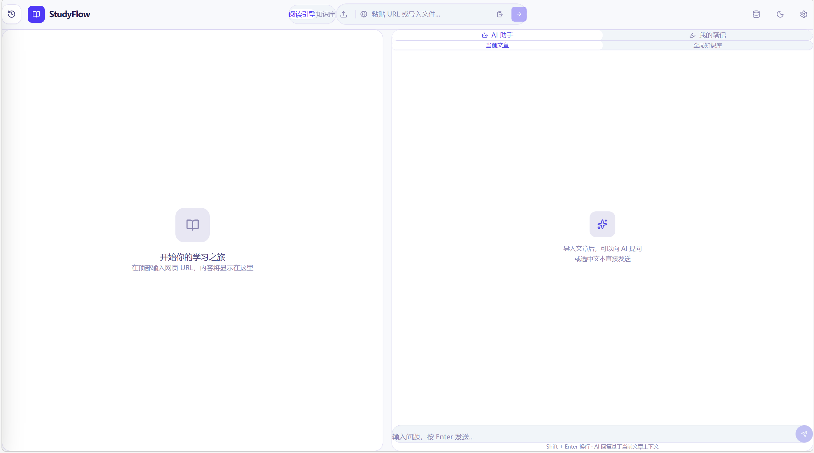

# StudyFlow — AI-Powered Study Assistant

<div align="center">


<br>
[](https://opensource.org/licenses/MIT)

<br>
<a href="#english">English</a> | <a href="#zh-cn">简体中文</a>
</div>

<div align="center">
  <br />
  
  <p><em>Clean and intuitive interface — unified reading engine, notebook, and knowledge base.</em></p>
</div>

---

<h2 id="english">English</h2>

**StudyFlow** is an AI-powered reading and learning workspace that combines:

- a **Reading Engine** (URLs + local files)
- an **AI Notebook** (notes alongside sources)
- a **Knowledge Base (RAG)** backed by **Qdrant**

It runs as a **web app** and a **native desktop app** (Electron).

### Features

- Read from URLs or upload `.pdf`, `.docx`, `.md`, `.txt`
- Chat with the current article or your entire knowledge base
- Build a private RAG knowledge base (chunk → embed → store → search)
- Streaming AI responses (SSE)
- Cross-platform desktop build with Electron
- Self-hostable with Docker (web + API + Qdrant)

### Tech Stack

- Frontend: React 19, Vite, TypeScript, Tailwind CSS v4
- Desktop: Electron
- Backend: Node.js (`scraper.mjs`) + Express
- Vector DB: Qdrant
- Models: Ollama or any OpenAI-compatible API

### Quick Start

#### Option A: Docker Compose (recommended)

```bash
docker compose up --build
# or: docker-compose up --build
```

Open: `http://localhost:5173`

#### Option B: Local development (web + API)

In two terminals:

```bash
npm install
npm run server
```

```bash
npm run dev
```

- Web: `http://localhost:5173`
- API: `http://localhost:3000` (Vite dev server proxies `/api` → `:3000`)

#### Option C: Desktop app (Electron)

```bash
npm install
npm run electron:dev
```

Build installer:

```bash
npm run electron:build
```

### Model Configuration

Open **Settings** in the app to configure both **Chat LLM** and **Embedding**.

Defaults are set for **Ollama**:

- Chat Base URL: `http://localhost:11434/v1`
- Embedding Base URL: `http://localhost:11434/v1`
- Models: `qwen2.5:7b` and `nomic-embed-text`

Any OpenAI-compatible endpoint should work (including GitHub Models and other providers) by setting:

- Base URL
- API Key
- Model name

### Knowledge Base (Qdrant)

Knowledge Base features require Qdrant at `http://localhost:6333` (default).

Run Qdrant quickly:

```bash
docker run --rm -p 6333:6333 -p 6334:6334 -v qdrant_storage:/qdrant/storage qdrant/qdrant:latest
```

You can override backend settings via environment variables (for `scraper.mjs`):

- `QDRANT_URL`, `QDRANT_COLLECTION`
- `UPLOAD_DIR`
- `OLLAMA_HOST`, `OLLAMA_MODEL`
- `EMBEDDING_BASE_URL`, `EMBEDDING_MODEL_NAME`, `EMBEDDING_API_KEY`

### GitHub Pages Note

This repo also builds a static site for GitHub Pages. Features that depend on the backend (URL scraping, LLM proxy, Knowledge Base) require your own running API and will not work on Pages alone.
To enable the online demo, set `VITE_API_BASE_URL` at build time to your deployed API base URL.

---

<h2 id="zh-cn">简体中文</h2>

**StudyFlow** 是一个 AI 驱动的阅读与学习工作台，集成了：

- **阅读引擎**（URL + 本地文件）
- **AI 笔记本**（边读边记）
- 基于 **Qdrant** 的 **知识库（RAG）**

支持 **Web** 与 **桌面端（Electron）**。

### 核心功能

- 支持 URL 抓取与上传 `.pdf` / `.docx` / `.md` / `.txt`
- AI 可基于当前文章或全局知识库进行对话
- 个人知识库：切片 → 向量化 → 存储 → 检索（RAG）
- 流式输出（SSE）
- Electron 桌面应用
- Docker 一键部署（Web + API + Qdrant）

### 技术栈

- 前端：React 19，Vite，TypeScript，Tailwind CSS v4
- 桌面端：Electron
- 后端：Node.js（`scraper.mjs`）+ Express
- 向量数据库：Qdrant
- 模型：Ollama 或任意 OpenAI 兼容接口

### 快速开始

#### 方式 A：Docker Compose（推荐）

```bash
docker compose up --build
# 或：docker-compose up --build
```

浏览器打开：`http://localhost:5173`

#### 方式 B：本地开发（Web + API）

两个终端分别运行：

```bash
npm install
npm run server
```

```bash
npm run dev
```

- Web：`http://localhost:5173`
- API：`http://localhost:3000`（开发环境下 `/api` 会被代理到 `:3000`）

#### 方式 C：桌面端（Electron）

```bash
npm install
npm run electron:dev
```

打包安装包：

```bash
npm run electron:build
```

### 模型配置

在应用内 **Settings** 中可分别配置对话模型与 Embedding 模型。

默认使用 **Ollama**：

- Chat Base URL：`http://localhost:11434/v1`
- Embedding Base URL：`http://localhost:11434/v1`
- 模型：`qwen2.5:7b` 与 `nomic-embed-text`

也支持任意 OpenAI 兼容接口（包括 GitHub Models 等），只需填写：

- Base URL
- API Key
- Model Name

### 知识库（Qdrant）

知识库功能需要 Qdrant（默认地址 `http://localhost:6333`）。

快速启动 Qdrant：

```bash
docker run --rm -p 6333:6333 -p 6334:6334 -v qdrant_storage:/qdrant/storage qdrant/qdrant:latest
```

`scraper.mjs` 可通过环境变量配置：

- `QDRANT_URL`, `QDRANT_COLLECTION`
- `UPLOAD_DIR`
- `OLLAMA_HOST`, `OLLAMA_MODEL`
- `EMBEDDING_BASE_URL`, `EMBEDDING_MODEL_NAME`, `EMBEDDING_API_KEY`

### GitHub Pages 说明

GitHub Pages 只部署静态页面。依赖后端的功能（URL 抓取、LLM 代理、知识库）需要你自行运行 API 服务，Pages 本身无法提供这些能力。
如果要让在线 Demo 可用，请在构建时设置 `VITE_API_BASE_URL` 为你部署的 API 地址。

---

<div align="center">
  <i>Built with care to make learning a flowing experience.</i>
</div>
