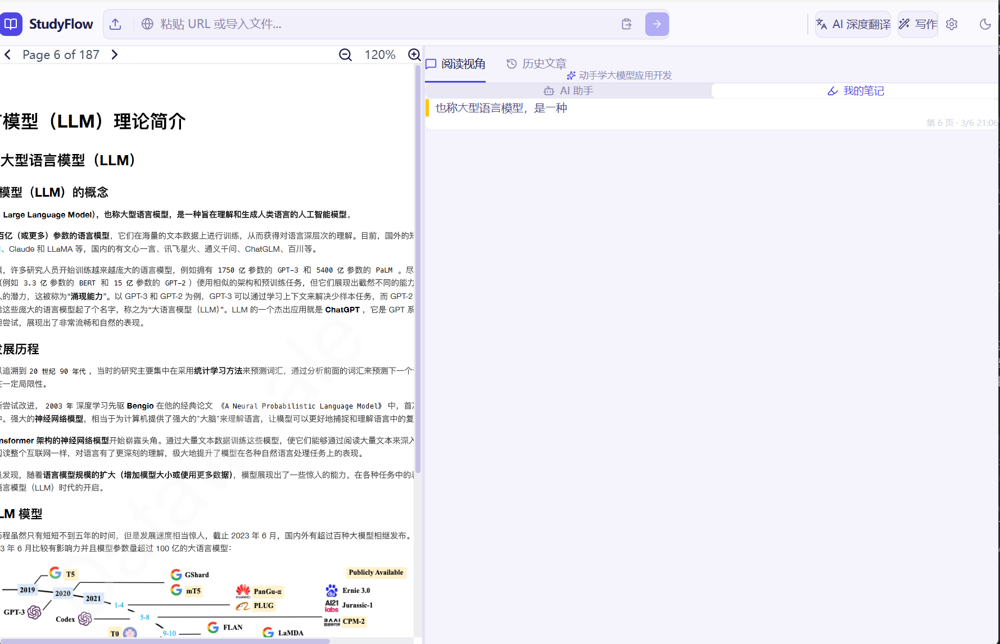
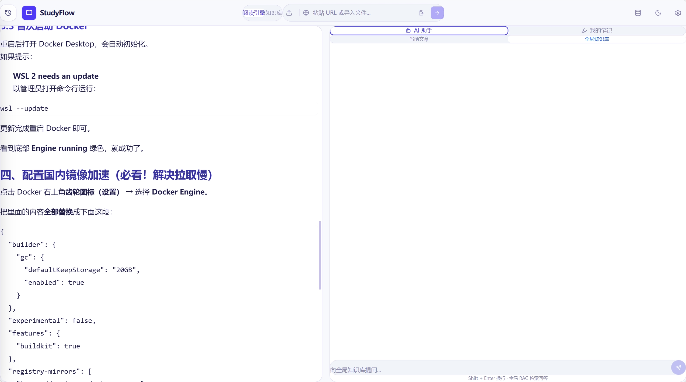
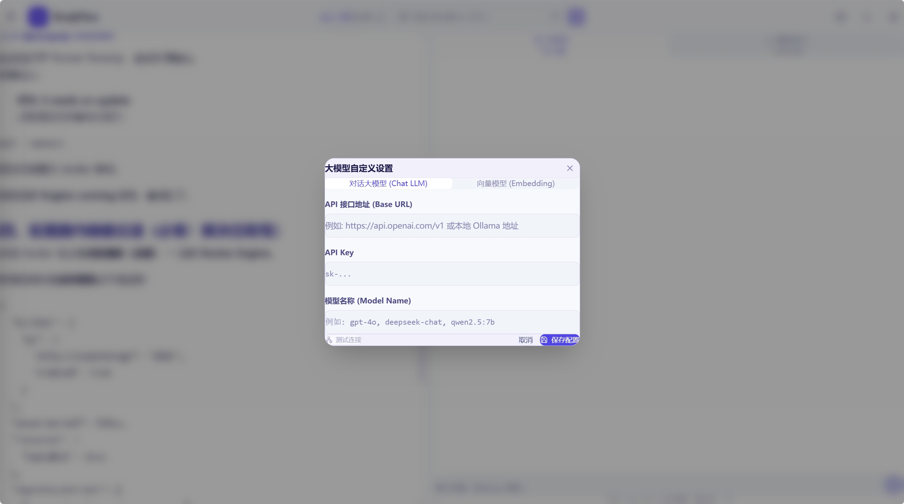
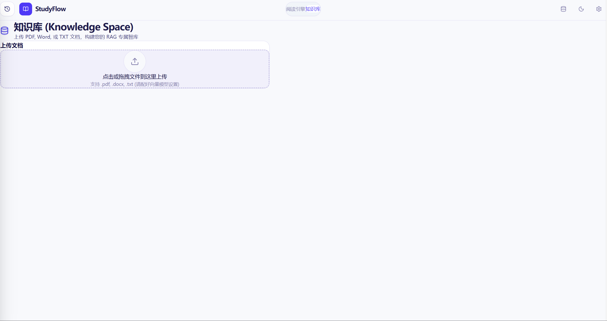

# StudyFlow - AI-Powered Study Assistant

<div align="center">


<br>
[](./LICENSE)

<br>
<a href="#english">English</a> | <a href="#zh-cn">简体中文</a>
</div>

<div align="center">
  <br />
  
  <p><em>Unified reading, AI chat, notes, and knowledge base in one workspace.</em></p>
</div>

---

<h2 id="english">English</h2>

**StudyFlow** is an AI-powered reading and learning workspace that combines:

- a reading engine for URLs and local files
- an AI notebook for side-by-side note taking
- a Qdrant-backed knowledge base for RAG
- web and desktop delivery in one codebase

### Features

- Read from URLs or upload `.pdf`, `.docx`, `.md`, `.txt`
- Chat with the current article or your full knowledge base
- Build a private RAG workflow: chunk -> embed -> store -> retrieve
- Stream AI responses in real time
- Configure local or cloud LLM endpoints
- Run as a web app, desktop app, or Docker deployment

<div align="center">
  
  <p><em>Read PDFs with formatting intact, annotate content, and keep notes beside the source.</em></p>
</div>

<div align="center">
  
  <p><em>Switch between current-article chat and global knowledge-base chat without leaving the reading flow.</em></p>
</div>

### Model Configuration

Open **Settings** in the app to configure both **Chat LLM** and **Embedding**.

Default local setup:

- Chat Base URL: `http://localhost:11434/v1`
- Embedding Base URL: `http://localhost:11434/v1`
- Chat Model: `qwen2.5:7b`
- Embedding Model: `nomic-embed-text`

You can also point StudyFlow to any OpenAI-compatible provider, including GitHub Models and other hosted APIs.

<div align="center">
  
  <p><em>Configure custom chat and embedding endpoints, API keys, and model names inside the app.</em></p>
</div>

### Knowledge Base (Qdrant)

Knowledge Base features require Qdrant at `http://localhost:6333` by default.

- Upload PDF, DOCX, or TXT files into a dedicated RAG space
- Store document chunks in Qdrant
- Query across your indexed materials through the same chat interface

<div align="center">
  
  <p><em>Upload files and build a dedicated RAG knowledge space for long-term retrieval and Q&A.</em></p>
</div>

Quick Qdrant startup:

```bash
docker run --rm -p 6333:6333 -p 6334:6334 -v qdrant_storage:/qdrant/storage qdrant/qdrant:latest
```

Backend environment variables:

- `QDRANT_URL`, `QDRANT_COLLECTION`
- `UPLOAD_DIR`
- `OLLAMA_HOST`, `OLLAMA_MODEL`
- `EMBEDDING_BASE_URL`, `EMBEDDING_MODEL_NAME`, `EMBEDDING_API_KEY`

### Tech Stack

- Frontend: React 19, Vite, TypeScript, Tailwind CSS v4
- Desktop: Electron
- Backend: Node.js + Express (`scraper.mjs`)
- Vector database: Qdrant
- Deployment: Docker Compose + Nginx

### Quick Start

#### Option A: Docker Compose

1. Clone the repository and enter the project:

```bash
git clone https://github.com/gongstudent/StudyFlow.git
cd StudyFlow
```

2. Start all services:

```bash
docker compose up --build
# or
docker-compose up --build
```

3. Open `http://localhost:5173`

If you already have old containers from a previous version, rebuild cleanly:

```bash
docker compose down
docker compose up --build
```

If Docker fails to pull base images such as `node` or `nginx`, check Docker Hub connectivity or your registry mirror first:

```bash
docker pull node:20.20.1-alpine3.23
docker pull nginx:1.29.6-alpine3.23
```

#### Option B: Local Development

Run the API and frontend in separate terminals:

```bash
npm install
npm run server
```

```bash
npm run dev
```

- Web: `http://localhost:5173`
- API: `http://localhost:3000`

#### Option C: Desktop App

```bash
npm install
npm run electron:dev
```

Build the installer:

```bash
npm run electron:build
```

### GitHub Pages Note

This repository also publishes a static GitHub Pages demo. Backend-dependent features such as URL scraping, LLM proxying, and knowledge-base chat require a running API service and do not work on Pages by themselves.

To enable the online demo, provide `VITE_API_BASE_URL` at build time and point it to your deployed backend.

---

<h2 id="zh-cn">简体中文</h2>

**StudyFlow** 是一个 AI 驱动的阅读与学习工作台，集成了：

- 面向 URL 与本地文件的阅读引擎
- 可与原文并排使用的 AI 笔记本
- 基于 Qdrant 的知识库与 RAG 检索能力
- 同时支持 Web 与桌面端的交付形态

### 核心功能

- 支持 URL 抓取与上传 `.pdf`、`.docx`、`.md`、`.txt`
- 可围绕当前文章或全局知识库进行问答
- 支持私有 RAG 流程：切片 -> 向量化 -> 存储 -> 检索
- 支持流式 AI 输出
- 支持本地模型与云端模型的自定义配置
- 支持 Web、Electron 与 Docker 部署

<div align="center">
  
  <p><em>保留文档版式进行阅读，同时在右侧完成 AI 交互与笔记整理。</em></p>
</div>

<div align="center">
  
  <p><em>在当前文章问答与全局知识库问答之间自由切换，保持连续的阅读流程。</em></p>
</div>

### 模型配置

在应用内的 **Settings** 中可以分别配置 **对话模型** 与 **Embedding 模型**。

默认本地配置：

- Chat Base URL：`http://localhost:11434/v1`
- Embedding Base URL：`http://localhost:11434/v1`
- 对话模型：`qwen2.5:7b`
- 向量模型：`nomic-embed-text`

你也可以接入任意 OpenAI 兼容接口，包括 GitHub Models 与其他云端 API。

<div align="center">
  
  <p><em>在应用内直接配置自定义聊天模型、向量模型、API Key 与服务地址。</em></p>
</div>

### 知识库（Qdrant）

知识库功能默认依赖 `http://localhost:6333` 上运行的 Qdrant。

- 支持上传 PDF、DOCX、TXT 文件构建专属 RAG 知识空间
- 文档切片后写入 Qdrant
- 可通过同一聊天界面对已索引资料进行检索式问答

<div align="center">
  
  <p><em>上传文档后即可构建专属知识空间，为后续检索与问答提供上下文基础。</em></p>
</div>

快速启动 Qdrant：

```bash
docker run --rm -p 6333:6333 -p 6334:6334 -v qdrant_storage:/qdrant/storage qdrant/qdrant:latest
```

后端支持的环境变量：

- `QDRANT_URL`, `QDRANT_COLLECTION`
- `UPLOAD_DIR`
- `OLLAMA_HOST`, `OLLAMA_MODEL`
- `EMBEDDING_BASE_URL`, `EMBEDDING_MODEL_NAME`, `EMBEDDING_API_KEY`

### 技术栈

- 前端：React 19、Vite、TypeScript、Tailwind CSS v4
- 桌面端：Electron
- 后端：Node.js + Express（`scraper.mjs`）
- 向量数据库：Qdrant
- 部署：Docker Compose + Nginx

### 快速开始

#### 方式 A：Docker Compose

1. 克隆仓库并进入项目目录：

```bash
git clone https://github.com/gongstudent/StudyFlow.git
cd StudyFlow
```

2. 启动全部服务：

```bash
docker compose up --build
# 或
docker-compose up --build
```

3. 浏览器打开 `http://localhost:5173`

如果之前已经运行过旧版本容器，建议先清理再重建：

```bash
docker compose down
docker compose up --build
```

如果 Docker 在拉取 `node`、`nginx` 等基础镜像时失败，请先检查 Docker Hub 连通性或镜像源配置：

```bash
docker pull node:20.20.1-alpine3.23
docker pull nginx:1.29.6-alpine3.23
```

#### 方式 B：本地开发

在两个终端中分别运行：

```bash
npm install
npm run server
```

```bash
npm run dev
```

- Web：`http://localhost:5173`
- API：`http://localhost:3000`

#### 方式 C：桌面端

```bash
npm install
npm run electron:dev
```

打包安装包：

```bash
npm run electron:build
```

### GitHub Pages 说明

仓库也提供 GitHub Pages 静态演示页，但 URL 抓取、LLM 代理、知识库问答等依赖后端的能力，不能仅靠静态页面独立运行。

如果希望在线 Demo 可用，请在构建时设置 `VITE_API_BASE_URL`，并指向你已经部署好的后端服务。

---

<div align="center">
  <i>Built with care to make learning feel continuous and organized.</i>
</div>
